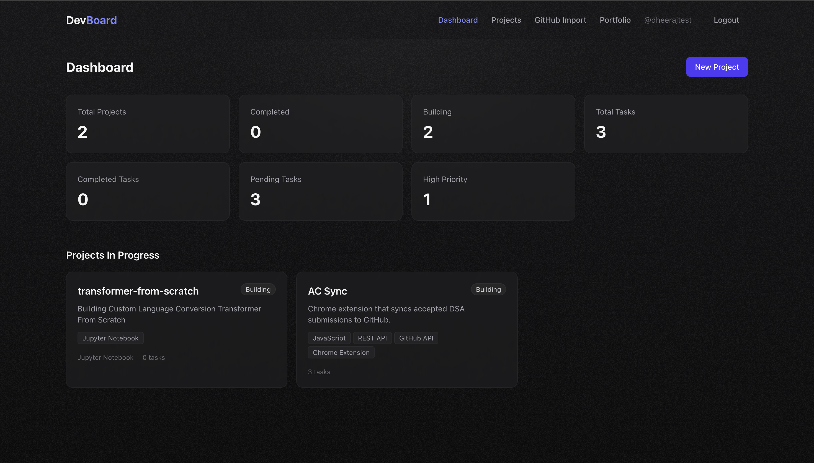
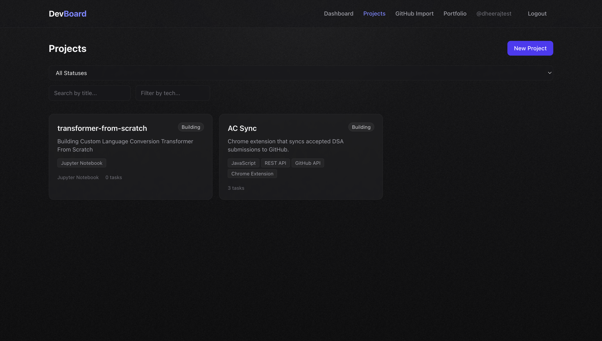

# DevBoard

**DevBoard** is a full-stack developer project management and portfolio platform. Track projects and tasks, import repositories from GitHub, view dashboard analytics, and share a public portfolio page — all behind JWT authentication with a modern, textured dark UI.

Built as a production-style portfolio project with clean API design, owner-scoped data access, and a recruiter-ready README.

---

## Highlights (Resume-Ready)

- Architected a **REST API** with Django REST Framework and **JWT auth** (register, login, refresh, profile) using owner-based permissions and validation-first error responses.
- Delivered **CRUD workflows** for projects and tasks with filtering, search, status/priority filters, and a aggregated **dashboard stats** endpoint.
- Integrated the **GitHub public API** to fetch repositories and one-click import projects with stars, forks, and language metadata.
- Built a **React + Vite** SPA with protected routes, Axios interceptors (token refresh), reusable components, and form validation.
- Designed a **charcoal textured UI** (noise overlay, glass-style cards, responsive layout) suitable for portfolio and GitHub screenshots.
- Structured the backend for **PostgreSQL readiness** via environment-driven database config while using SQLite for local development.
- Documented APIs with a **Postman collection** and clear setup instructions for local development.

---

## Features

| Area | Capabilities |
|------|----------------|
| **Authentication** | Register (returns user + JWT), login, token refresh, profile read/update |
| **Projects** | Create, list, detail, update, delete; filter by status, search title, filter tech stack |
| **Tasks** | CRUD per project; filter by status, priority, project; search by title |
| **Dashboard** | Total/completed/building projects, task counts, pending & high-priority tasks |
| **GitHub** | Fetch public repos by username; import selected repo as a DevBoard project |
| **Public portfolio** | Unauthenticated `/dev/:username` page with completed projects and tech stacks |
| **UI/UX** | Dark textured theme, stat cards, empty states, loading states, error handling |

---

## Tech Stack

| Layer | Technologies |
|-------|----------------|
| **Frontend** | React 19, Vite, Tailwind CSS v4, React Router, Axios |
| **Backend** | Python, Django 4.2, Django REST Framework |
| **Auth** | djangorestframework-simplejwt (JWT) |
| **Database** | SQLite (development), PostgreSQL-ready configuration |
| **API testing** | Postman collection included |
| **Version control** | Git / GitHub |

---

## Screenshots

### Dashboard
Overview of project and task metrics with quick access to in-progress work.



### Projects
Browse, filter, and search projects with status and tech stack tags.



### Project detail & tasks
Manage tasks with status, priority, and deadlines inside each project.


### GitHub import
Fetch public repositories and import them as DevBoard projects.


---

## Quick Start

### Prerequisites

- **Python 3.9+**
- **Node.js 18+** and npm
- Git (optional)

### 1. Clone the repository

```bash
git clone <your-repo-url>
cd DevBoard
```

### 2. Backend setup

```bash
cd backend
python3 -m venv venv
source venv/bin/activate          # Windows: venv\Scripts\activate
pip install -r requirements.txt
cp .env.example .env
python manage.py migrate
python manage.py createsuperuser  # optional — Django admin
python manage.py runserver
```

API base URL: **http://localhost:8000/api/**

### 3. Frontend setup

Open a new terminal:

```bash
cd frontend
npm install
cp .env.example .env
npm run dev
```

App URL: **http://localhost:5173**

### 4. Try it out

1. Register at `/register`
2. Create a project from **Projects → New Project**
3. Add tasks on the project detail page
4. Import repos via **GitHub Import**
5. View your public portfolio at `/dev/<username>` (completed projects only)

---

## Environment Variables

### Backend (`backend/.env`)

| Variable | Description | Default |
|----------|-------------|---------|
| `SECRET_KEY` | Django secret key | Change in production |
| `DEBUG` | Debug mode | `True` |
| `ALLOWED_HOSTS` | Comma-separated hosts | `localhost,127.0.0.1` |
| `DB_ENGINE` | Database engine | `django.db.backends.sqlite3` |
| `DB_NAME` | DB name or SQLite path | `db.sqlite3` |
| `DB_USER` | PostgreSQL user | — |
| `DB_PASSWORD` | PostgreSQL password | — |
| `DB_HOST` | PostgreSQL host | `localhost` |
| `DB_PORT` | PostgreSQL port | `5432` |
| `CORS_ALLOWED_ORIGINS` | Allowed frontend origins | `http://localhost:5173` |

**PostgreSQL example:**

```env
DB_ENGINE=django.db.backends.postgresql
DB_NAME=devboard
DB_USER=postgres
DB_PASSWORD=your_password
DB_HOST=localhost
DB_PORT=5432
```

### Frontend (`frontend/.env`)

| Variable | Description | Default |
|----------|-------------|---------|
| `VITE_API_BASE_URL` | Backend API base URL | `http://localhost:8000/api` |

---

## API Endpoints

| Method | Endpoint | Auth | Description |
|--------|----------|------|-------------|
| `POST` | `/api/auth/register/` | No | Register user (returns user + JWT tokens) |
| `POST` | `/api/auth/login/` | No | Login — obtain access & refresh tokens |
| `POST` | `/api/auth/refresh/` | No | Refresh access token |
| `GET` | `/api/auth/me/` | Yes | Current authenticated user |
| `GET` / `PUT` / `PATCH` | `/api/auth/profile/` | Yes | Read or update profile |
| `GET` | `/api/projects/` | Yes | List current user's projects |
| `POST` | `/api/projects/` | Yes | Create project |
| `GET` | `/api/projects/:id/` | Yes | Project detail |
| `PUT` / `PATCH` | `/api/projects/:id/` | Yes | Update project |
| `DELETE` | `/api/projects/:id/` | Yes | Delete project |
| `GET` | `/api/tasks/` | Yes | List current user's tasks |
| `POST` | `/api/tasks/` | Yes | Create task |
| `GET` | `/api/tasks/:id/` | Yes | Task detail |
| `PUT` / `PATCH` | `/api/tasks/:id/` | Yes | Update task |
| `DELETE` | `/api/tasks/:id/` | Yes | Delete task |
| `GET` | `/api/dashboard/stats/` | Yes | Dashboard statistics |
| `GET` | `/api/public/:username/` | No | Public portfolio |
| `GET` | `/api/github/repos/?username=` | Yes | Fetch GitHub public repos |
| `POST` | `/api/github/import/` | Yes | Import repo as project |

### Query parameters

**Projects:** `?status=planned|building|completed&search=<title>&tech=<stack>`

**Tasks:** `?status=todo|in_progress|done&priority=low|medium|high&search=<title>&project=<id>`

### Sample: Register

```bash
curl -X POST http://localhost:8000/api/auth/register/ \
  -H "Content-Type: application/json" \
  -d '{
    "username": "johndoe",
    "email": "john@example.com",
    "password": "SecurePass123!",
    "password_confirm": "SecurePass123!",
    "first_name": "John",
    "last_name": "Doe"
  }'
```

### Sample: Dashboard stats

```json
{
  "total_projects": 5,
  "completed_projects": 2,
  "building_projects": 2,
  "total_tasks": 12,
  "completed_tasks": 7,
  "pending_tasks": 5,
  "high_priority_tasks": 2
}
```

---

## Folder Structure

```
DevBoard/
├── backend/
│   ├── devboard_backend/       # Django project (settings, urls)
│   ├── accounts/               # Auth, UserProfile, JWT views
│   ├── projects/               # Project & Task models, dashboard, public API
│   ├── github_sync/            # GitHub fetch & import
│   ├── manage.py
│   ├── requirements.txt
│   └── .env.example
├── frontend/
│   ├── src/
│   │   ├── api/                # Axios client & interceptors
│   │   ├── components/         # Navbar, cards, forms, loader, etc.
│   │   ├── context/            # AuthContext (JWT in localStorage)
│   │   ├── pages/              # Login, Dashboard, Projects, GitHub, Portfolio
│   │   ├── utils/              # Error helpers
│   │   └── index.css           # Global theme (charcoal + noise texture)
│   ├── package.json
│   └── .env.example
├── postman/
│   └── DevBoard.postman_collection.json
├── screenshots/                # App screenshots for README
└── README.md
```

---

## Postman

Import **`postman/DevBoard.postman_collection.json`** into Postman.

| Variable | Value |
|----------|--------|
| `base_url` | `http://localhost:8000/api` |
| `access_token` | Set automatically after **Login** request |

---

## Future Improvements

- [ ] Deploy with **PostgreSQL** on Railway / Render / AWS
- [ ] **GitHub OAuth** login and automatic repo sync
- [ ] JWT **token blacklist** on logout
- [ ] **Email verification** and password reset
- [ ] Project **cover images** and file uploads
- [ ] **WebSocket** or polling for real-time task updates
- [ ] **Unit & integration tests** (pytest, React Testing Library)
- [ ] **Docker Compose** for one-command local setup
- [ ] **CI/CD** (GitHub Actions: lint, test, build)
- [ ] Portfolio **custom domains** and SEO metadata

---

## License

MIT
